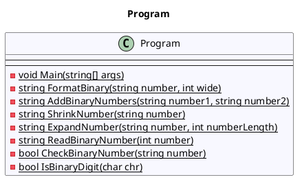

# POSE

## POSE

### BinaryAdder, 3ABIF/3AKIF

Lehrziele

- Stringbearbeitung
- Methoden

#### Aufgabenstellung

Ihr Programm liest zwei (beliebig lange) Binärzahlen ein und addiert sie. Die Benutzerführung hat sich an der unten stehenden Vorgabe zu orientieren


Wird eine Fehleingabe gemacht, ist entsprechend zu reagieren:


**Hinweise:**

- Versuchen  Sie,  gleiche  Abläufe  in  Methoden  zu  strukturieren.  Das  Einlesen  einer  Dualzahl,  bis endlich eine korrekte Dualzahl eingegeben wurde, ist z.B. ein Fixkandidat für eine Methode, die für beide Dualzahlen verwendet werden kann.
- Die Addition wird einfacher, wenn zuvor beide Summanden auf gleiche Länge gebracht werden! Dazu muss der kürzere Summand mit führenden Nullen aufgefüllt werden.

**Erweiterungsoption:** Trennen Sie ganze Bytes bei der Ausgabe der Dualzahlen so, dass nach 8 Bits immer ein Leerzeichen folgt.

**Testvorgaben:**

|**Summand 1**  |**Summand 2**   |**Summe**       |
| -             | -              | -              |
|10101010101010 |101010101010101 |111111111111111 |
|1010           |111             |10001           |
|10110101       |10101           |11001010        |
|1010           |0               |1010            |

## Class Diagram

```plantUml
@startuml
Bob -> Alice : hello
@enduml
```

```plantuml
Bob -> Alice : hello
```



### Test


### Program (CD)


## Activity Diagrams

### Program.Main (AC)


### Program.FormatBinary (AC)


### Program.AddBinaryNumbers (AC)


### Program.ShrinkNumber (AC)


### Program.ExpandNumber (AC)


### Program.ReadBinaryNumber (AC)


### Program.CheckBinaryNumber (AC)


### Program.IsBinaryDigit (AC)


## Sequence Diagrams

### Program.Main (SQ)


### Program.FormatBinary (SQ)


### Program.AddBinaryNumbers (SQ)


### Program.ShrinkNumber (SQ)


### Program.ReadBinaryNumber (SQ)


### Program.CheckBinaryNumber (SQ)


