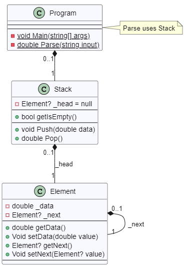

# POSE

## UPN-Calculator

Lehrziele

- Erstellen einfacher Klassen (Stack und Element)
- Anwendung der abstrakte Datenstruktur ‚Stack’.

### Aufgabenstellung

In dieser Übung ist ein so genannter *UPN-Calculator* zu implementieren. Das Besondere an diesem Rechner ist, dass dieser ohne die Verwendung von Klammern auskommt. Operanden und Zwischenergebnisse werden auf den Stack abgelegt.

Beispiel:

(5 + 3) \* 2 wird als 5 3 + 2 \* in den Rechner eingegeben

Der Rechner analysiert die eingegebene Zeile und speichert alle Zahlen auf den Stack. Kommt er zu einem Operation (bei uns ‚+’ ‚-’ ‚\*’ ‚/’ -> das sind alles zweistellig Operationen) werden zwei Operanden vom Stack genommen, der Operator auf die zwei Operanden angewandt und das Ergebnis (in unserem Fall 5 3 + -> 8) wird wieder auf den Stack gestellt. Nach dem Ende der Eingabe muss am Stack genau eine Zahl liegen. Diese Zahl stellt das Ergebnis der Rechenoperation dar.

Folgende Aufgaben sind zu bewältigen:

- Einlesen eines Terms in UPN-Notation
- Ablegen von Zahlen auf den Stack
  - Realisierung des Stacks als lineare Liste
- Den Rechner ausführlich auf korrekte Implementierung testen.

Die Programmstruktur ist entsprechend dem nachfolgenden Klassendiagramm zu entwickeln:

**Ausgabe:**

Eine mögliche Ausgabe zeigt die folgende Abbildung:

#### Erweiterte Anforderungen für Spezialisten

- Keine

#### Dokumente

- Lösungsidee (Notizen bitte in einer Mappe sammeln)
- Ablaufdiagramm (Konzept)
- Kommentierter Programmcode (Programmkopf bitte nicht vergessen)
- Testdokumentation (kann auch in dieser Übungsangabe enthalten sein)

#### Ergebnisdokumente

- Kommentierter Programmcode (erkläre in Kommentare deine Gedanken)

**Viel Spaß!**

## Class Diagram

### ObjectDiagram (CD)

### Program (CD)

### Stack (CD)

### Element (CD)

## Activity Diagrams

### ObjectDiagram.Generate (AC)

### Program.Main (AC)

### Program.Parse (AC)

### Stack.Push (AC)

### Stack.Pop (AC)

## Sequence Diagrams

### ObjectDiagram.Generate (SQ)

### Program.Main (SQ)

### Program.Parse (SQ)

### Stack.Push (SQ)

### Stack.Pop (SQ)

